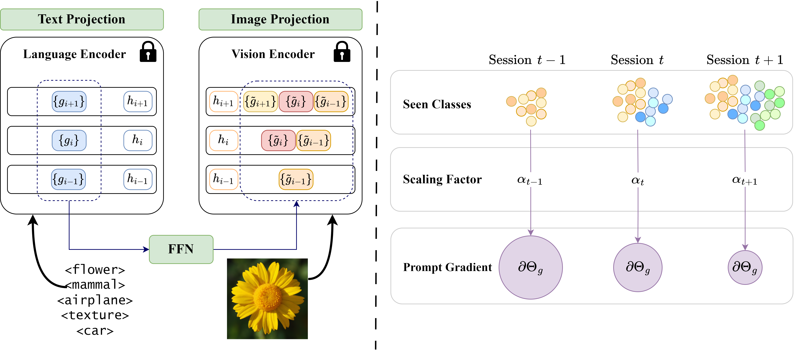

# CPE-CLIP
Official implementation of the ["*Multimodal Parameter-Efficient Few-Shot Class Incremental Learning*"](https://arxiv.org/abs/2303.04751) paper, presented at the 2023 IEEE/CVF International Conference on Computer Vision Workshops (ICCVW).

## About
CPE-CLIP is a CLIP-based Continual Learning model architecture showing promising performance in Few-Shot Class Incremental Learning by leveraging prompt-tuning and a time-varying regularizer.



## Installation

Clone the repository and install the python dependencies with:

```
pip install -r requirements.txt
```

Extra requirements:
- Python 3.10.6
- PyTorch >= 1.12.1
- CUDA >= 11.4

## Model
The code for the CLIP model adapted for parameter-efficient learning used in the paper is located in `/CoLeLib/models/clip_models` and contains:
- **CLIPTextModelForPromptTuning**: a modified CLIP Language Encoder that accepts learnable prompts to prepend to tokens layerwise.
- **CLIPVisionModelFroPromptTuning**: a modified CLIP Vision Encoder that accepts learnable prompts to append to patch embeddings layerwise.
- **CLIPParameterEfficient**: the final wrapper combining both the encoders and applying parameter-efficient contrastive-learning.

## Data

The datasets used in the paper are:

- [miniImageNet](https://paperswithcode.com/dataset/mini-imagenet)
- [CUB200](https://www.vision.caltech.edu/datasets/cub_200_2011/)
- [CIFAR100](https://www.cs.toronto.edu/~kriz/cifar.html#:~:text=The%20CIFAR%2D100%20dataset)

In order to train the model, you need to first manually download the datasets and splits. We provide the data and datasets splits used for the experiments in the following [Google Drive shared folder](https://drive.google.com/drive/folders/1nVZJFySisbrq0t8ReGX6Yyg2MOtAkCdQ?usp=drive_link). Both datasets and splits should be downloaded, extracted and placed in the `/data` and `/splits` folders respectively. Follow the steps provided in the [splits README](/splits/README.md) and [data README](/data/README.md) for more information.

## Training

To train the model, run the following command:

```bash
python train.py --L_g 2 --deep_g 12 --dataset_name dataset_name --n_runs 5
```

You can call the `train.py` script with the following parameters:
- `--L_g` (required): Number of prompts to be used in the encoders.
- `--deep_g` (required): Number of layers of the encoders in which the prompts will be processed.
- `--text_deep_replace_method` (optional): Method to replace the text encoder. The available options are `replace`, `accumulate`, and `accumulate_same`. The default value is `replace`.
- `--vision_deep_replace_method` (optional): Method to replace the vision encoder. The available options are `replace`, `accumulate`, and `accumulate_same`. The default value is `accumulate`.
- `--dataset_name` (required): Name of the dataset to be used for training. The available options are `miniimageNet`, `cub200`, and `cifar100`.
- `--nruns` (optional): Number of runs to be executed for the training. The results will be averaged over the runs.
- `--ablation` (optional): Ablation mode to be used for the training. The available options are `no_accumulation`, `no_regularization`, and `no_vision_prompts`.
- `--seeds` (optional): List of seeds to be used for the training. Each seed would be used in order for the runs. **Note**: The number of seeds must be equal to the number of runs.

The results of the training will be saved in JSON format in the root folder (see [results](/results.ipynb) notebook to process the file).

### Ablation

In case you want to test the results for the ablation study, you can use the `--ablation` flag to test the model with different configurations:

```bash
python train.py --Lg 2 --deep_g 12 --dataset_name dataset_name --n_runs 5 --ablation ablation_mode
```

The options available for the `--ablation` argument are:
- `no_accumulation`: No prompt accumulation in the vision encoder.
- `no_regularization`: No regularizer applied to prompt's weights.
- `no_vision_prompts`: Remove vision prompts from the model.

## Citation

```bibtex
@INPROCEEDINGS{10350931,
  author={D’Alessandro, Marco and Alonso, Alberto and Calabrés, Enrique and Galar, Mikel},
  booktitle={2023 IEEE/CVF International Conference on Computer Vision Workshops (ICCVW)}, 
  title={Multimodal Parameter-Efficient Few-Shot Class Incremental Learning}, 
  year={2023},
  volume={},
  number={},
  pages={3385-3395},
  keywords={Training;Vocabulary;Visualization;Transfer learning;Computer architecture;Image representation;Power capacitors;continual learning;lifelong learning;clip;contrastive learning;vision language;multimodal;prompt learning},
  doi={10.1109/ICCVW60793.2023.00364}
}
```